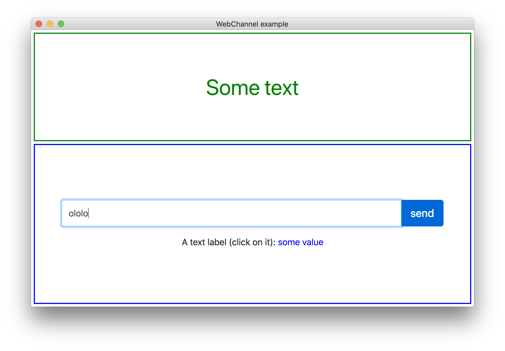

# QML WebChannel and WebSockets

QML examples for WebChannel and WebSockets.

More details in the following [article](https://retifrav.github.io/blog/2018/07/14/html-from-qml-over-webchannel-websockets/).
